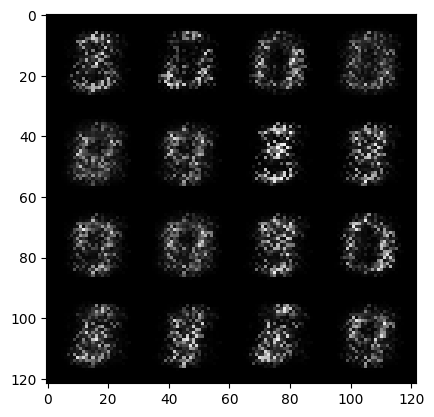
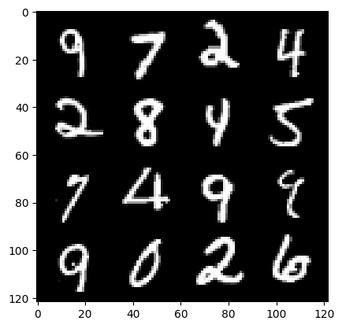

# MNIST Number Image Generative GAN

This project is a beginner implementation of a Generative Adversarial Network (GAN) to generate handwritten digits resembling those in the MNIST dataset. The project was created as part of my learning journey into deep learning and generative models.

## Features
- Uses the MNIST dataset of handwritten digits.
- Implements a basic GAN with:
  - **Generator**: Creates synthetic handwritten digit images.
  - **Discriminator**: Distinguishes between real and fake digit images.
- Trains the GAN to improve the quality of generated images over epochs.
- Visualizes the generated images during training.

## Dataset
- **MNIST Dataset**: A collection of 60,000 training and 10,000 testing images of handwritten digits (0-9), each 28x28 pixels in grayscale.

## Dependencies
- Python (>= 3.7)
- TensorFlow/Keras or PyTorch (depending on the framework used)
- NumPy
- Matplotlib (for visualizations)

## How It Works
1. **Generator**: Takes random noise as input and outputs 28x28 grayscale images.
2. **Discriminator**: Classifies images as real (from the dataset) or fake (from the generator).
3. **Training**:
   - Both models are trained in a loop where:
     - The generator improves at creating images to fool the discriminator.
     - The discriminator improves at identifying real vs. fake images.
   - Losses are computed using binary cross-entropy.

## Results
- The GAN generates synthetic images of handwritten digits.  
- Below is an example of generated images after training:

## Learnings
- Basics of GAN architecture.
- Importance of balancing generator and discriminator during training.
- Challenges like training instability and mode collapse.

## Future Improvements
- Use advanced techniques like conditional GANs (CGAN) to generate specific digits.
- Experiment with architectures like DCGAN for better image quality.
- Add functionality to save and reload trained models.
